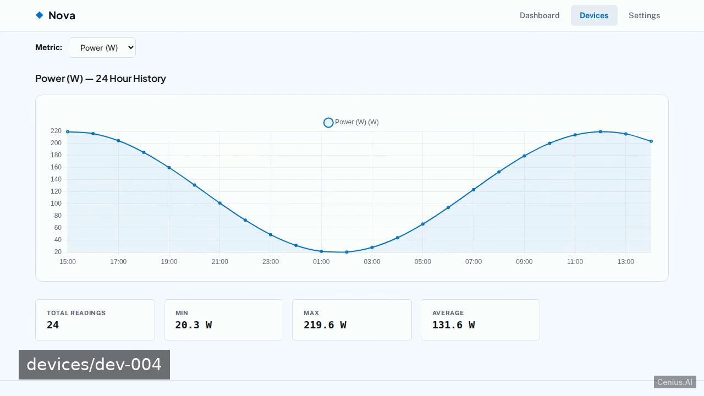
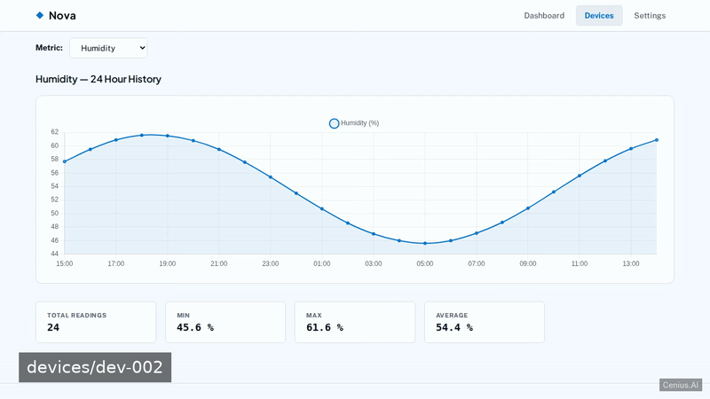
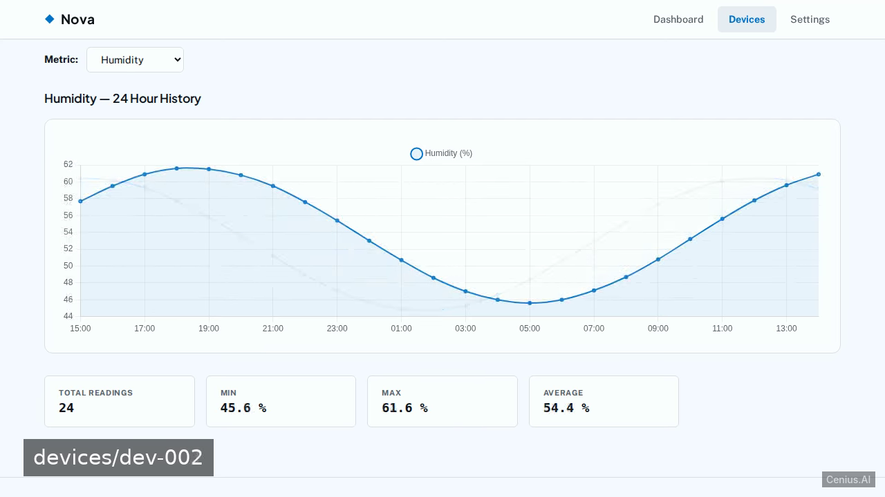
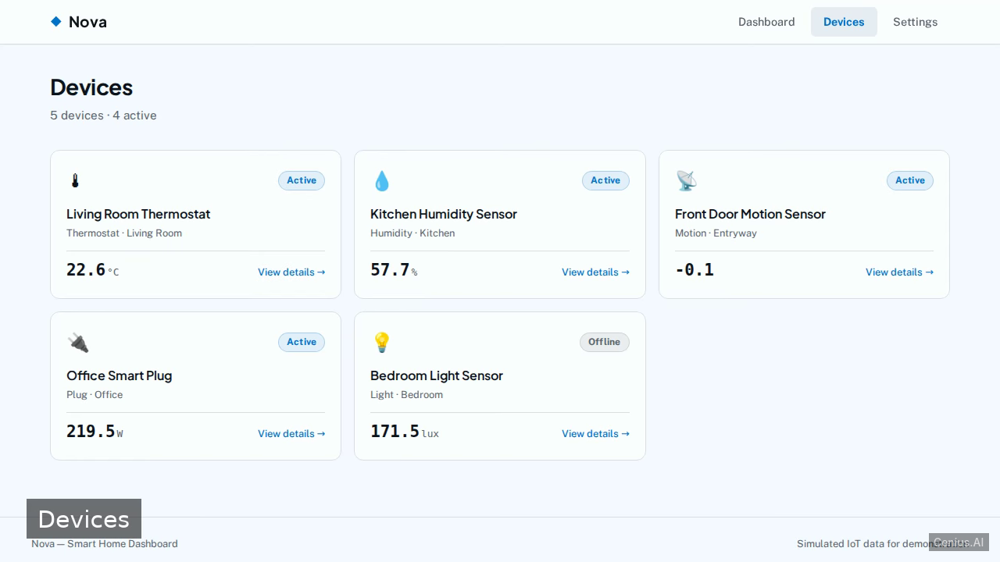

# Nova Smart Home Dashboard — production-ready Clojure monitoring dashboard starter

**Nova Smart Home Dashboard** is a free, open-source monitoring dashboard built with Clojure. A home automation IoT dashboard built with Clojure (Ring/Reitit), featuring interactive history charts, multiple pages, seeded demo data, and a polished, responsive UI with light and dark themes. Run it locally, deploy it as a self-hosted monitoring dashboard, or [remix it on cenius.ai](https://cenius.ai/marketplace/p/nova-smart-home-dashboard?ref=gh&utm_campaign=nova-smart-home-dashboard-clojure) to make it your own — the whole application (code, design, seeded demo data) ships in this repository under the Apache-2.0 license.

[](LICENSE)  [](https://cenius.ai)

[](https://cenius.ai/marketplace/p/nova-smart-home-dashboard?ref=gh&utm_campaign=nova-smart-home-dashboard-clojure)

> **▶ [Open & edit in cenius.ai](https://cenius.ai/marketplace/p/nova-smart-home-dashboard?ref=gh&utm_campaign=nova-smart-home-dashboard-clojure)** — one click to an editable workspace: describe changes in plain English, get an instant preview, one-click deploy and host. Modifications made on the platform come with full rebrand & relicense rights.

_Local clone? See [Quick start](#quick-start) below. cenius.ai is the zero-setup path._

## Demo





▶ **[Watch the full demo video](https://cenius.ai/marketplace/p/nova-smart-home-dashboard?ref=gh&utm_campaign=nova-smart-home-dashboard-clojure)** — the complete walkthrough, playing on the project's cenius.ai page · [MP4 file](.github/media/demo.mp4)

## Screenshots

  

## Features

- Dashboard with device overview and summary
- Detailed device history charts
- Light / dark theme toggle
- Multi-page navigation

## Quick start

```bash
./install.sh   # installs dependencies + seeds demo data
```

See [`INSTALL.md`](INSTALL.md) for full setup and usage instructions.

## Usage guide

Once the server is running (via `clojure -M -m nova.core`), open a browser to:

```
http://localhost:3000
```

### Screens

#### Dashboard (`/`)

The main overview with history charts (powered by Chart.js) showing device trends. Toggle between light and dark themes using the control in the header.

#### Devices (`/devices`)

List all configured smart home devices. Each device shows its name, type, and current status.

#### Device Detail (`/devices/:id`)

Click a device on the Devices page to view detailed information, including real-time data and individual controls (e.g., on/off, brightness).

#### Settings (`/settings`)

Adjust user preferences, theme selection, and other dashboard configuration options.

### API Endpoints

The backend exposes RESTful endpoints used by the frontend:

- `GET /api/devices` – list all devices (JSON)
- `GET /api/devices/:id` – get a single device's details
- `POST /api/devices/:id/action` – send a command to a device (payload: `{"action": "..."}`)

Example using curl:

```bash
curl http://localhost:3000/api/devices
```

```bash
curl -X POST http://localhost:3000/api/devices/1/action \
  -H "Content-Type: application/json" \
  -d '{"action": "toggle"}'
```

All device data is seeded from `src/nova/seed.clj` when the server starts.

_Full guide: [`USAGE.md`](USAGE.md)_

## Architecture

Clojure application, delivered as a complete, runnable project (35 files). Top-level layout: `resources/`, `src/`. `install.sh` provisions dependencies and seeds demo data, so the app boots with something to show. Setup details live in [`INSTALL.md`](INSTALL.md).

## FAQ

### What does it take to self-host Nova Smart Home Dashboard?

Everything you need ships in this repo: clone it, run `./install.sh` to install dependencies and seed demo data, then follow [`INSTALL.md`](INSTALL.md) to start it. No external services required.

### Can I change Nova Smart Home Dashboard without writing code?

Open it on [cenius.ai](https://cenius.ai/marketplace/p/nova-smart-home-dashboard?ref=gh&utm_campaign=nova-smart-home-dashboard-clojure) and describe the changes you want in plain English — the platform modifies the app and gives you a new, downloadable build.

### What powers Nova Smart Home Dashboard under the hood?

The app is built with Clojure. What you see in this repo is the full production source, demo data included. Highlights include dashboard with device overview and summary.

### Is Nova Smart Home Dashboard free for commercial use?

Yes. The code is Apache-2.0-licensed — use it, modify it, and ship it commercially. See [LICENSE](LICENSE).

### Can I rebrand or white-label Nova Smart Home Dashboard?

Yes. You can edit the source directly under the MIT license, or [remix it on cenius.ai](https://cenius.ai/marketplace/p/nova-smart-home-dashboard?ref=gh&utm_campaign=nova-smart-home-dashboard-clojure) — the platform route grants full rebrand and relicense rights over your derivative.

## License & rebranding

Released under the [Apache License 2.0](LICENSE) (© 2026 Cenius AI) — free for personal and commercial use. The Cenius name/logo are trademarks (see NOTICE).

**Need a customized version?** [Remix this app on cenius.ai](https://cenius.ai/marketplace/p/nova-smart-home-dashboard?ref=gh&utm_campaign=nova-smart-home-dashboard-clojure) — modifications made on the platform come with **full rebrand & relicense rights** over your derivative.

## Built with cenius.ai

This entire application — code, design, seeded demo data — was generated on **[cenius.ai](https://cenius.ai)** from a plain-English description.

- 🚀 [Build your own app on cenius.ai](https://cenius.ai)
- 🎛️ [Remix Nova Smart Home Dashboard on the marketplace](https://cenius.ai/marketplace/p/nova-smart-home-dashboard?ref=gh&utm_campaign=nova-smart-home-dashboard-clojure) — open it in a workspace, prompt for changes, and ship your own version.

More open-source apps: [the Cenius-ai catalog](https://github.com/Cenius-ai) · [showcase index](https://github.com/Cenius-ai/showcase)
